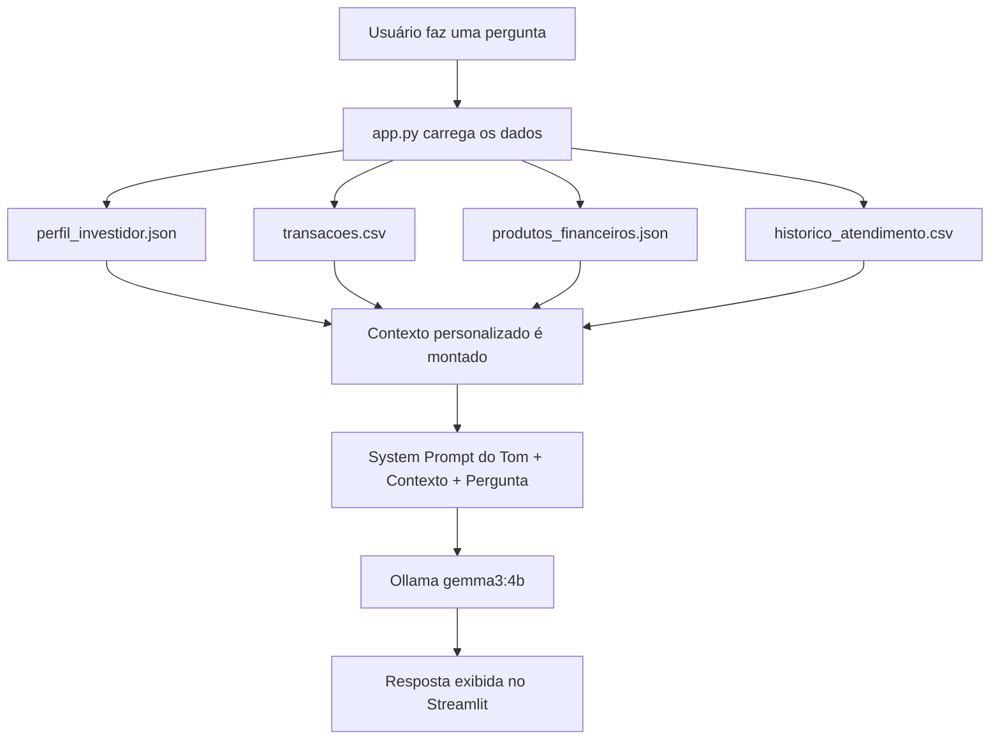

# Tom — Educador Financeiro com IA

> Tom é um chatbot educador financeiro com personalidade felina, criado para ajudar jovens adultos a entenderem finanças pessoais de forma simples e acessível.

---

## Documentação

[01-documentacao-agente.md](https://github.com/juccca/smart-finance-agent/blob/main/docs/01-documentacao-agente.md)

---

## Sobre o Projeto

Tom foi inspirado em um gatinho de verdade e tem uma missão séria: tornar a educação financeira acessível para quem nunca teve esse aprendizado formal. Ele analisa o perfil, os gastos e os objetivos do usuário para oferecer orientações personalizadas — sem jargões e sem julgamentos.

**Tom não recomenda investimentos. Ele ensina como eles funcionam.**

---

## Como Funciona



---

## Estrutura do Projeto

```
tom/
├── data/
│   ├── perfil_investidor.json       # Perfil e metas do usuário
│   ├── transacoes.csv               # Histórico de receitas e gastos
│   ├── produtos_financeiros.json    # Produtos financeiros disponíveis
│   └── historico_atendimento.csv    # Histórico de conversas anteriores
├── src/
│   └── app.py                       # Aplicação principal (Streamlit)
├── docs/
│   └── 01-documentacao-agente.md   # Documentação do agente
└── README.md
```

---

## Como Rodar

### Pré-requisitos

- Python 3.10+
- [Ollama](https://ollama.com) instalado e rodando localmente
- Modelo `gemma3:4b` baixado no Ollama

```bash
ollama pull gemma3:4b
```

### Instalação

```bash
# Clone o repositório
git clone https://github.com/juccca/smart-finance-agent.git
cd tom

# Instale as dependências
pip install -r src/requirements.txt
```

### Executando

```bash
cd src
streamlit run app.py
```

Acesse em: `http://localhost:8501`

---

## Dependências

```
streamlit
pandas
requests
```
