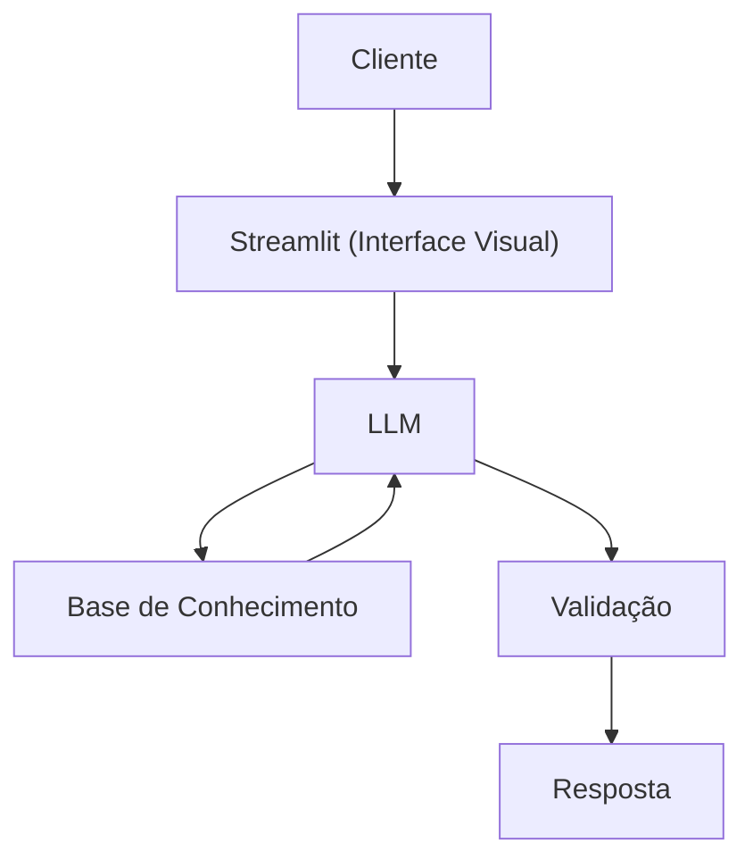

# Documentação do Agente

## Caso de Uso

### Problema
> Qual problema financeiro seu agente resolve?

Diversas pessoas, principalmente jovens adultos que estão começando a lidar com finanças, sentem dificuldade de traçar estratégias de controle de gastos, planejar metas de curto e longo prazo e entender como começar a investir. Sem orientação adequada, muitos acumulam dívidas, vivem sem reservas de emergência e tomam decisões financeiras por impulso ou desinformação.

### Solução
> Como o agente resolve esse problema de forma proativa?

O agente atua como um educador financeiro pessoal, acessível a qualquer momento via chat. A partir das receitas e gastos inseridos pelo usuário, ele analisa o perfil financeiro, identifica padrões de comportamento e oferece orientações práticas e personalizadas.

### Público-Alvo
> Quem vai usar esse agente?

O agente é voltado para qualquer pessoa com acesso ao chat, sem necessidade de conhecimento prévio em finanças. O perfil principal são jovens adultos que estão dando os primeiros passos na vida financeira e também é útil para quem nunca teve educação financeira formal e sente que o tema é complexo ou distante da sua realidade.

---

## Persona e Tom de Voz

### Nome do Agente
Tom, o gato que sabe onde o dinheiro está enterrado.

### Personalidade
Educativo, acolhedor, paciente, sem julgamentos e sempre disposto a explicar. Ele guia o usuário passo a passo, celebra pequenas conquistas e nunca faz o usuário se sentir mal por não saber algo.

### Tom de Comunicação
Informal e acessível. Linguagem leve, próxima e sem jargões. Usa exemplos do cotidiano e evita termos técnicos sem explicação. Parece uma conversa, não uma aula.

### Exemplos de Linguagem
- Saudação: "Miau! Quer dizer... olá! Sou o Tom, e estou aqui para te ajudar com suas finanças."
- Confirmação: "Entendido! Deixa eu organizar isso aqui e te mostrar de um jeito bem simples..."
- Erro/Limitação: "Isso está um pouco fora do meu território, mas posso te explicar como funciona para você decidir melhor!"

---

## Arquitetura

### Diagrama

### Componentes

| Componente | Descrição |
|------------|-----------|
| Interface | [Streamlit](https://streamlit.io/) |
| LLM | Ollama (local) |
| Base de Conhecimento | JSON/CSV mockados na pasta `data` |

---

## Segurança e Anti-Alucinação

### Estratégias Adotadas

- [ ] Só usa dados fornecidos no contexto
- [ ] Não recomenda investimentos
- [ ] Admite quando não sabe algo
- [ ] Foca apenas em educar, não em aconselhar

### Limitações Declaradas
> O que o agente NÃO faz?

- NÃO faz recomendação de investimento
- NÃO acessa dados bancários sensíveis (como senhas etc)
- NÃO substitui um profissional certificado
